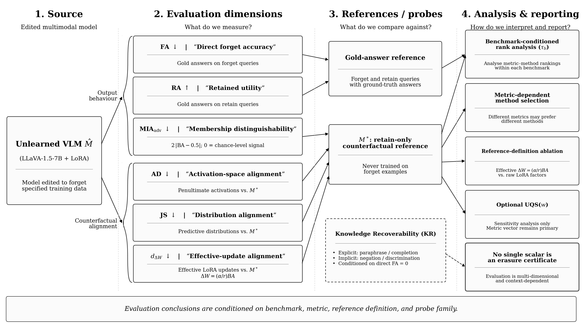
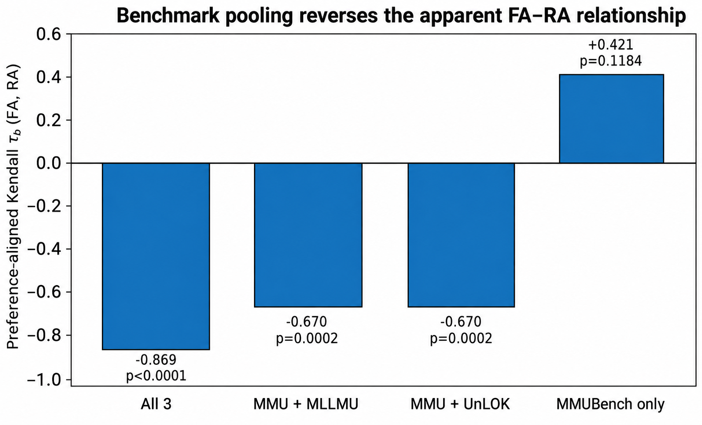
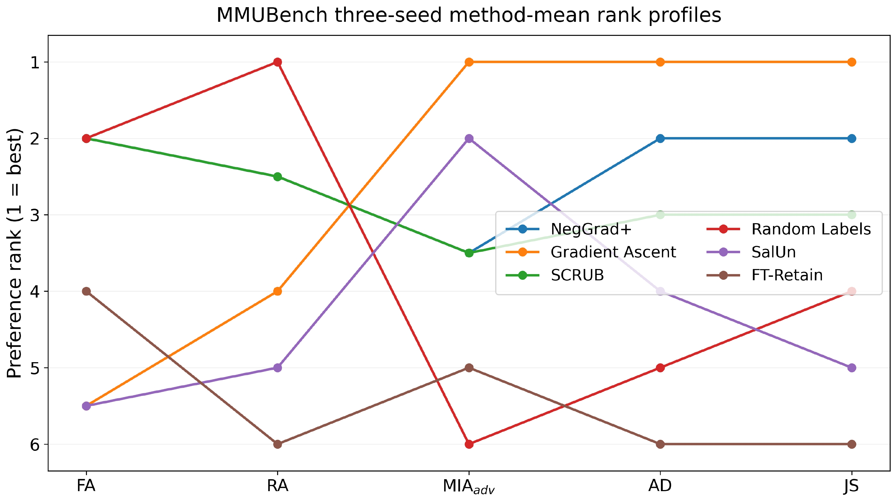
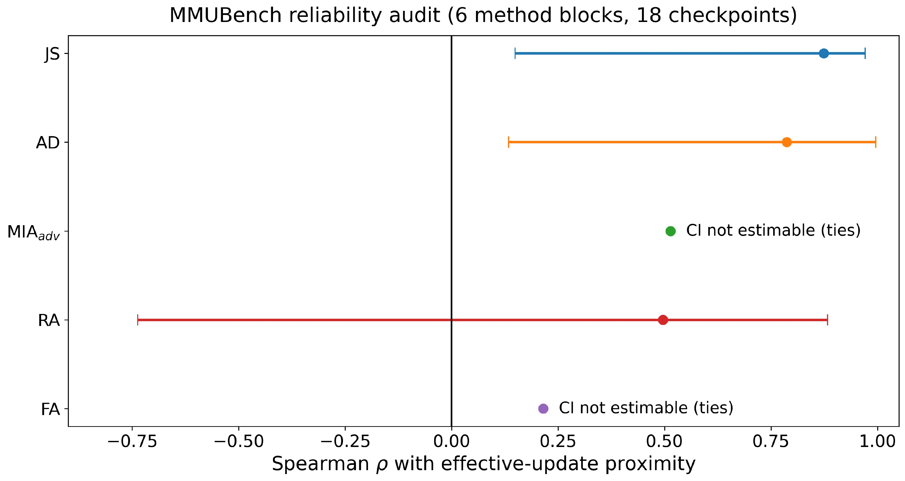
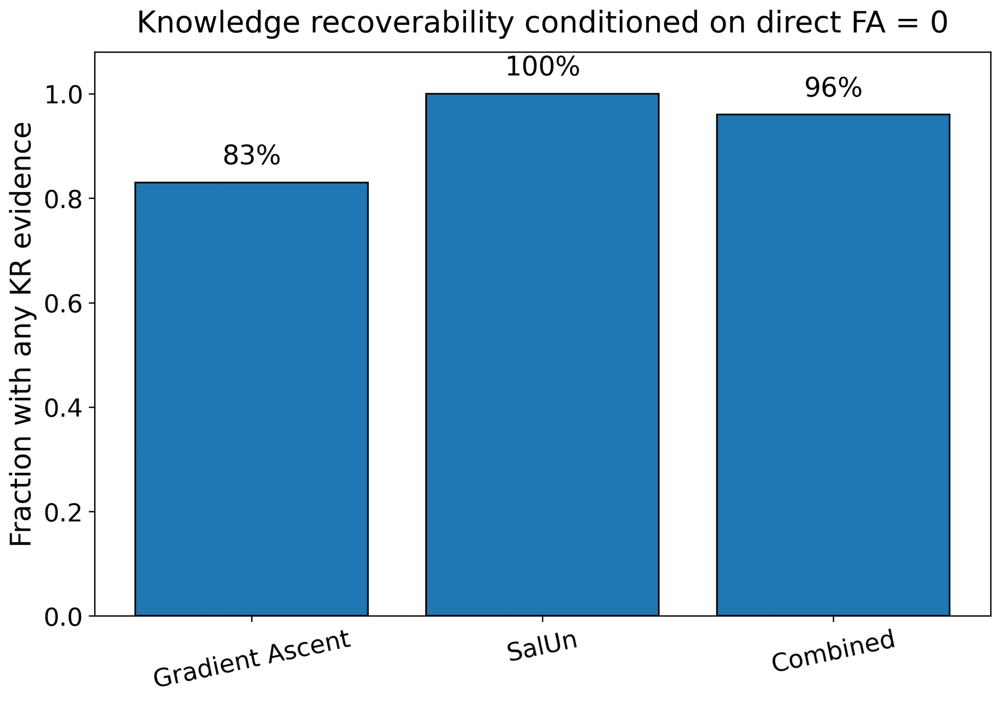
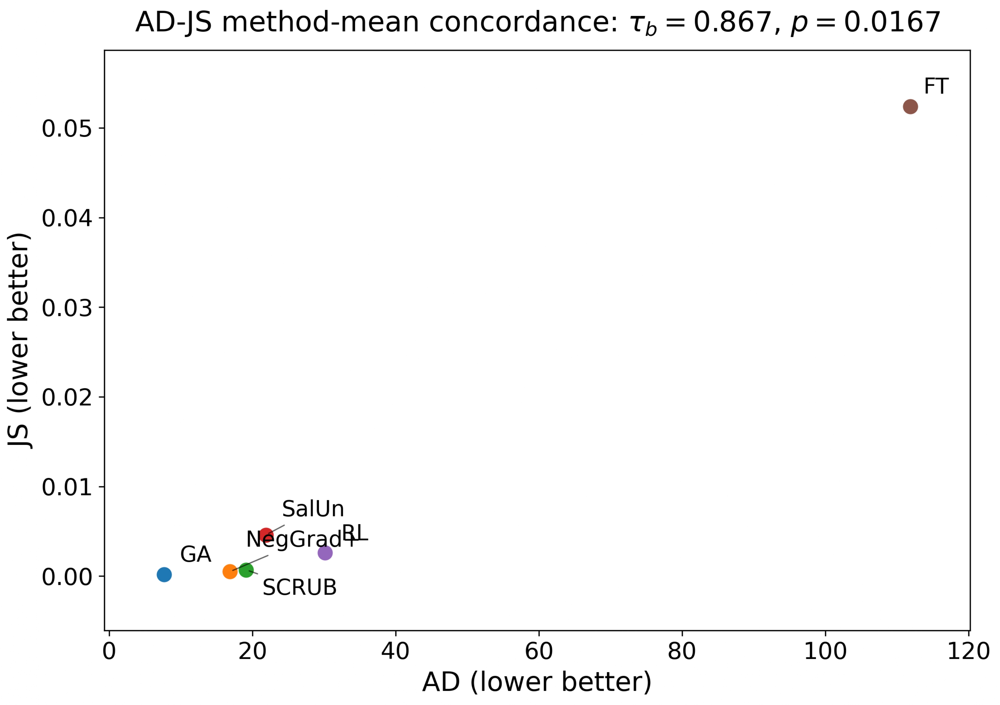

# Evaluation Reliability in Multimodal Machine Unlearning

### Benchmark Conditioning, Reference Consistency, and Knowledge Recoverability

[](LICENSE)
[](https://www.python.org/)

This repository accompanies the paper:

> **Evaluation Reliability in Multimodal Machine Unlearning: Benchmark Conditioning, Reference Consistency, and Knowledge Recoverability**  
> Abdullah Ahmad Khan, Hamid Laga, and Ferdous Sohel

---

## Overview

How reliable are the criteria used to evaluate multimodal machine unlearning?

Rather than proposing another unlearning algorithm, this work audits how conclusions about an edited multimodal model depend on:

- the **benchmark operating regime**;
- the **evaluation criterion**;
- the **counterfactual reference and its representation**; and
- the **probe family used to test residual knowledge**.

The experiments show that these choices can materially change the conclusion drawn about an unlearning method.

<p align="center">
  
</p>

<p align="center">
  <em>
  Evaluation conclusions are conditioned on benchmark, metric,
  reference definition, and probe family.
  </em>
</p>

---

## Key Findings

### 1. Benchmark operating regime changes the observed relationship

Across three VQA benchmarks, pooled forgetting-retention rankings show a strong negative association:

\[
\tau_b=-0.869.
\]

When the benchmark is held fixed to MMUBench:

\[
\tau_b=+0.421,\qquad p=0.1184.
\]

The pooled relationship therefore should not be interpreted as an intrinsic or universal forgetting-retention trade-off.

<p align="center">
  
</p>

---

### 2. Different criteria can prefer different methods

Holding the benchmark fixed does not eliminate evaluation disagreement.

Within the common six-method MMUBench panel, different criteria emphasize different properties of an edited model.

For example:

- **Gradient Ascent (GA)** performs strongly under AD and JS but poorly under direct forget accuracy.
- **Random Labels (RL)** shows strong FA and RA ranks but weak membership-distinguishability performance.
- **NegGrad+** and **SCRUB** show comparatively consistent equal-weight rank profiles.

Mean rank and rank dispersion are used only as **descriptive summaries**. They do not establish a universally preferred method.

<p align="center">
  
</p>

---

### 3. Reference-based diagnostics show cross-space consistency

Edited models are compared with the same retain-only counterfactual reference \(M^*\), which was not trained on the forget examples.

Reference proximity is examined in:

1. **activation space** — AD;
2. **predictive-distribution space** — JS; and
3. **effective adapter-update space** — \(d_{\Delta W}\).

Across the 18 common-MMUBench checkpoints, association with effective-update proximity is strongest for:

- **JS:** \(\rho=+0.874\)
- **AD:** \(\rho=+0.787\)

At the method level, AD and JS show strong concordance:

\[
\tau_b=0.867,\qquad p_{\mathrm{exact}}=0.0167.
\]

This agreement is interpreted as **cross-space reference consistency**, not external validation, because the reference-based quantities share the same retain-only anchor.

<p align="center">
  
</p>

---

### 4. Direct suppression does not establish semantic erasure

A model can fail to produce the target answer under the original query while still retaining information that supports recovery under another probe.

We therefore evaluate **Knowledge Recoverability (KR)** separately.

KR is applied only to cases satisfying:

\[
\mathrm{FA}=0.
\]

#### Explicit probes

Explicit evidence requires reconstruction of target information, including:

- paraphrased questions;
- completion prompts; and
- indirect questions requiring the target fact.

#### Implicit probes

Implicit evidence tests whether target information remains discriminatively accessible without requiring free reconstruction, including:

- negation probes; and
- candidate-discrimination probes.

### KR pilot

| Method | Directly suppressed cases | Any KR evidence |
|---|---:|---:|
| Gradient Ascent | 6 | 5/6 (83%) |
| SalUn | 18 | 18/18 (100%) |
| **Combined** | **24** | **23/24 (96%)** |

Residual target information was therefore detected in **23 of 24** directly suppressed cases.

This is a bounded pilot over a finite, non-adaptive probe family. It is **not** an estimate of worst-case adversarial recovery probability.

<p align="center">
  
</p>

---

## Evaluation Framework

The study distinguishes several evaluation dimensions rather than treating forgetting as a single quantity.

| Criterion | Preferred direction | Measures | Does **not** establish |
|---|:---:|---|---|
| **FA** | ↓ | Direct target-answer accuracy | Semantic erasure |
| **RA** | ↑ | Retained-task utility | Successful forgetting |
| **MIA<sub>adv</sub>** | ↓ | Membership distinguishability under the evaluated attack | General privacy |
| **AD** | ↓ | Activation-space proximity to \(M^*\) | Semantic erasure |
| **JS** | ↓ | Predictive-distribution proximity to \(M^*\) | Semantic erasure |
| **d<sub>ΔW</sub>** | ↓ | Effective LoRA-update proximity to \(M^*\) | Functional equivalence |
| **KR** | ↓ | Recoverability under the evaluated probes | Exhaustive worst-case leakage |

No individual criterion is treated as an erasure certificate.

---

## Experimental Design

Two analysis panels are deliberately kept separate.

### Cross-Benchmark Panel

**4 methods × 3 benchmarks × 3 unlearning seeds = 36 checkpoints**

#### Methods

- Gradient Ascent (GA)
- Random Labels (RL)
- FT-Retain
- SalUn

#### Benchmarks

- MLLMU-Bench
- UnLOK-VQA
- MMUBench

This panel is used to study **benchmark conditioning and pooling effects**.

### Common-MMUBench Panel

**6 methods × 3 unlearning seeds = 18 checkpoints**

#### Methods

- Gradient Ascent
- Random Labels
- FT-Retain
- SalUn
- NegGrad+
- SCRUB

This panel is used for:

- common-benchmark method comparison;
- metric-dependent method selection;
- reference-consistency analysis; and
- descriptive equal-weight rank profiles.

The two panels are kept separate because their method coverage differs.

---

## Benchmark Conditioning

The evaluated benchmarks occupy different operating regimes under the studied direct-answer configuration.

In particular, MLLMU-Bench and UnLOK-VQA show compressed operating behavior in this configuration, whereas MMUBench provides greater discrimination among the evaluated methods.

This observation is **configuration-specific**. It does not imply that either MLLMU-Bench or UnLOK-VQA is intrinsically defective.

The main implication is that pooled statistics should be interpreted only after examining benchmark-specific operating support.

---

## Identifiable LoRA Reference Distance

Raw LoRA factors are not uniquely identifiable.

For a LoRA update,

\[
\Delta W=\frac{\alpha}{r}BA,
\]

an invertible transformation \(S\) can produce:

\[
B'=BS^{-1},
\qquad
A'=SA,
\]

while preserving:

\[
B'A'=BA.
\]

Therefore, Euclidean distances between raw \(A\) and \(B\) factors can change even when the effective model update remains unchanged.

For parameter-space reference analysis, we instead compare effective updates:

\[
d_{\Delta W}(\widehat{M},M^*)
=
\frac{1}{L}
\sum_{\ell=1}^{L}
\frac{
\left\|
\Delta W_{\ell}^{(\widehat{M})}
-
\Delta W_{\ell}^{(M^*)}
\right\|_F
}{
\left\|
\Delta W_{\ell}^{(M^*)}
\right\|_F+\epsilon
}.
\]

This removes raw-factor reparameterization ambiguity.

The resulting quantity remains an **effective adapter-update diagnostic**, not a unique functional distance between neural networks.

---

## Membership-Distinguishability Correction

The final analysis uses a chance-centered membership-distinguishability measure.

For each checkpoint:

\[
\mathrm{BA}
=
\frac{\mathrm{TPR}+\mathrm{TNR}}{2},
\]

and

\[
\mathrm{MIA}_{\mathrm{adv}}
=
2|\mathrm{BA}-0.5|.
\]

Therefore:

- \(\mathrm{MIA}_{\mathrm{adv}}=0\) corresponds to chance-level performance under the evaluated attack;
- larger values indicate greater membership distinguishability.

The transformation is performed **checkpoint-by-checkpoint before seed averaging**.

This is an attack-specific diagnostic and is **not** interpreted as a general privacy guarantee.

---

## AD-JS Method-Level Concordance

Activation-space and predictive-distribution reference diagnostics show strong method-level agreement in the common-MMUBench panel:

\[
\tau_b(\mathrm{AD},\mathrm{JS})=0.867,
\qquad
p_{\mathrm{exact}}=0.0167.
\]

The supplementary analysis visualizes the corresponding method means.

<p align="center">
  
</p>

Because both diagnostics use the same retain-only \(M^*\), their agreement should not be interpreted as independent ground truth.

---

## Optional Scalarization

The **metric vector remains the primary evidence**.

A single scalar ordering requires an externally specified deployment utility.

For sensitivity analysis, the supplementary material includes an illustrative Unified Quality Score (UQS):

\[
\mathrm{UQS}
=
0.0745(1-\mathrm{FA})
+
0.1719\,\mathrm{RA}
+
0.1781(1-\mathrm{MIA}_{\mathrm{adv}})
+
0.2727e^{-\mathrm{AD}/100}
+
0.3028(1-\mathrm{JS}).
\]

These weights are:

- data-dependent;
- reference-dependent;
- not statistically optimal;
- not externally validated; and
- not universal.

The UQS is therefore retained only as a **sensitivity example**.

> **No single scalar is treated as an erasure or privacy certificate.**

---

## Secondary Architecture Check

A limited qualitative check is provided using **BLIP-2 OPT-2.7B** on MMUBench at seed 42.

For the two evaluated methods:

| Method | FA | RA | AD |
|---|---:|---:|---:|
| GA | 0.667 | 0.600 | 1.87 |
| FT-Retain | 0.667 | 0.630 | 44.84 |

Because this experiment contains only **two methods and one seed**, it is not presented as cross-architecture replication.

The main quantitative conclusions are based on the LLaVA-1.5-7B experiments.

---

## Statistical Conventions

All rank analyses are preference aligned.

- Lower is better for **FA**, **MIA<sub>adv</sub>**, **AD**, and **JS**.
- Higher is better for **RA**.
- Rank 1 always denotes better performance.
- Ties use midranks.

The three unlearning seeds are:

```text
42
123
5508
```

They share the same seed-42 base model.

They therefore characterize variability in the **unlearning procedure**, not independent full-training replications.

### Dependence structure

For the cross-benchmark analysis:

- 36 checkpoints
- 12 method × benchmark blocks

For the common-MMUBench analysis:

- 18 checkpoints
- 6 method blocks
- 3 unlearning seeds per method

Dependence-aware block/cluster procedures are used where appropriate.

---

## Recommended Evaluation Protocol

Based on the audit, multimodal-unlearning studies should:

1. establish that target information is measurably present **before unlearning**;
2. report benchmark-specific operating regimes before pooling;
3. report the underlying metric vector;
4. keep analysis panels separate when method coverage differs;
5. align metric directions consistently;
6. report rank summaries only as descriptive quantities alongside the original measurements;
7. account for dependence among seeds and checkpoints;
8. define counterfactual references explicitly;
9. use identifiable representations for parameter-space comparisons;
10. test recoverability after direct suppression;
11. distinguish explicit from implicit residual knowledge; and
12. state the utility, normalization, weights, and sensitivity analysis of any scalarization.

---

## Reproducibility

### Hardware and Software

The main experiments were conducted using:

- NVIDIA RTX 4090 — 24 GB
- Windows 11
- Python 3.x
- PyTorch
- Hugging Face Transformers
- PEFT

### Base Adaptation

- Optimizer: AdamW
- Learning rate: \(2\times10^{-5}\)
- Batch size: 2
- Precision: FP16
- Epochs: 1
- Maximum sequence length: 768 tokens
  - 576 image tokens
  - 192 text tokens

### Unlearning

- Optimizer: AdamW
- Learning rate: \(10^{-5}\)
- Cosine learning-rate scheduling
- Gradient clipping: 1.0

GA, RL, and FT-Retain use two epochs.

SalUn uses a saliency threshold of 0.5 followed by retain fine-tuning.

NegGrad+ uses:

\[
\alpha=\beta=1.
\]

SCRUB uses:

\[
\gamma=1,
\qquad
\alpha_{\mathrm{KL}}=0.5.
\]

### Approximate Compute

- Original 36-checkpoint experiment: approximately **200 GPU-hours**
- NegGrad+/SCRUB extension: approximately **24 additional GPU-hours**

---

## Quickstart

Clone the repository:

```bash
git clone https://github.com/abdullahak07/UnifiedUnl.git
cd UnifiedUnl
```

Install dependencies:

```bash
pip install -r requirements.txt
```

### Quick analysis check

```bash
python benchmark/run_benchmark.py --quick
```

### Analyse pre-computed results

```bash
python benchmark/run_benchmark.py --results-only
```

### Full experimental pipeline

```bash
python download_models.py
python main.py --stage all
```

See `REPRODUCE.md` for the complete reproduction procedure and hardware requirements.

---

## Repository Structure

```text
UnifiedUnl/
├── main.py
├── config.py
├── download_models.py
├── run_blip2_minimal.py
├── kr_pilot.py
│
├── models/
├── data/
├── unlearning/
├── evaluation/
├── analysis/
├── benchmark/
├── scripts/
│
├── outputs/
│   ├── multimodal_results.json
│   ├── unimodal_results.json
│   ├── uqs_weights.json
│   ├── blip2_minimal_summary.json
│   ├── kr_pilot_results.json
│   ├── analysis_results.json
│   │
│   ├── figures/
│   │   ├── Figure_1_Evaluation_Framework.png
│   │   ├── Figure_2_Pooling_Reversal.png
│   │   ├── Figure_3_Method_Rank_Profiles.png
│   │   ├── Figure_4_Reliability_Audit.png
│   │   ├── Figure_S1_KR_Pilot.png
│   │   └── Figure_S2_AD_JS_Method_Means.png
│   │
│   └── tables/
│
├── REPRODUCE.md
├── DATASHEET.md
├── CITATION.cff
├── LICENSE
└── croissant_metadata.json
```

---

## Figure Files

For GitHub rendering, PNG versions of the manuscript figures should be present in:

```text
outputs/figures/
```

Expected filenames:

```text
Figure_1_Evaluation_Framework.png
Figure_2_Pooling_Reversal.png
Figure_3_Method_Rank_Profiles.png
Figure_4_Reliability_Audit.png
Figure_S1_KR_Pilot.png
Figure_S2_AD_JS_Method_Means.png
```

PDF versions can additionally be retained for publication-quality reproduction.

GitHub READMEs render the PNG files inline; the PDFs can be linked separately if required.

---

## Scope and Limitations

The main quantitative experiments use **LLaVA-1.5-7B with LoRA**.

The three unlearning seeds share one seed-42 base model and therefore are not independent full-training replications.

MLLMU-Bench and UnLOK-VQA occupy compressed operating regimes under the evaluated direct-answer configuration. This is configuration-specific and does not imply that either benchmark is intrinsically defective.

The retain-only \(M^*\) is a counterfactual reference rather than a unique ground-truth retraining solution.

Effective-update distance removes raw LoRA-factor non-identifiability but is not a unique functional distance over the data manifold.

The KR experiment uses a finite probe family and is not an exhaustive adversarial recovery evaluation.

\(\mathrm{MIA}_{\mathrm{adv}}\) describes the evaluated membership attack and is not a general privacy guarantee.

The BLIP-2 experiment is qualitative and does not support architecture-level generalization.

Mean-rank statistics and rank dispersion are descriptive summaries and should be interpreted alongside the underlying metric values.

This framework is intended as a **technical evaluation methodology**, not as a determination of GDPR or other regulatory compliance.

---

## Citation

If you use this repository or its evaluation framework, please cite the accompanying paper:

```bibtex
@article{khan2026evaluation,
  title   = {Evaluation Reliability in Multimodal Machine Unlearning:
             Benchmark Conditioning, Reference Consistency,
             and Knowledge Recoverability},
  author  = {Khan, Abdullah Ahmad and Laga, Hamid and Sohel, Ferdous},
  year    = {2026}
}
```

Replace this temporary entry with the final venue-specific bibliographic information once available.

---

## Related Work by the Authors

Our earlier work introduced **Hessian-Guided Gradient Unlearning (HGU)**, an approximate gradient-based unlearning method that combines first-order updates with Hessian-guided refinement:

**Abdullah Ahmad Khan, Mohammed Kaosar, Hamid Laga, and Ferdous Sohel.  
“Hessian-guided gradient unlearning.” Neurocomputing, 2026, 135115.**

DOI: `10.1016/j.neucom.2026.135115`

The present repository addresses a different question: rather than introducing another unlearning update, it investigates **how reliably different evaluation criteria support conclusions about multimodal unlearning**.

---

## License

This project is licensed under the **Apache License 2.0**.

See `LICENSE` for details.
